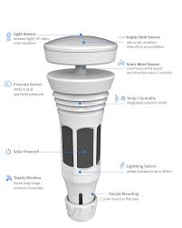
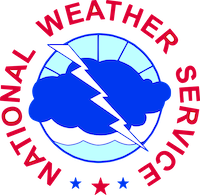
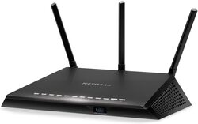

# HOME ASSISTANT

## Weather Integrations

#### [Tempest Weather System](https://weatherflow.com/tempest-weather-system/)
The current weather station I use is the Tempest Weather System. This is the best personal weather station I have owned. The issue with most weather systems I've used is the lack of features, battery power and ruggedness.  The Tempeset Weather System solves all three.

#### [National Weather Service (NWS) Forecast](https://www.home-assistant.io/integrations/nws/)
I use the NWS for local forecasts and outlook. The NWS Integration is easy to setup and find weather for any location in the US.

[Tempest Weather System Integation](https://github.com/briis/smartweatherudp) | [NWS Forecast Integration](https://www.home-assistant.io/integrations/nws/)
|:-------------:|:-------------:|
 | 

## Network Monitoring

#### [Netgear Nighthawk R6700v3](https://www.netgear.com/support/product/R6700V3.aspx)

Netgear Nighthawk R6700v3 | [Pi-hole Integration](https://www.home-assistant.io/integrations/pi_hole/)
|:-------------:|:-------------:|
 | 

---
Customizations from https://www.home-assistant.io
